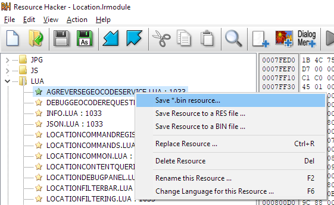
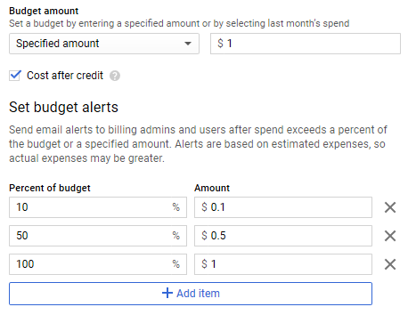

# Fixing the Map Module in Lightroom Classic

As of December 1, 2018, the Map functionality in non-subscription versions of Lightroom stopped working. Adobe [suggests](https://helpx.adobe.com/lightroom/kb/map-view-no-longer-supported.html) buying a subscription to Lightroom CC (120 USD/year) or to copy & paste GPS coordinates into your favorite search engine (LOL!). 

This project resurrects the lost functionality, without subscribing to Lightroom CC.

To achieve this, we will modify Lightroom to use our own Google Maps API key instead of Adobe's. While we need a subscription with Google, that subscription includes 200 USD of free use credits per month, which should be sufficient for casual users of the Lightroom Map module.

### Table of contents
- [Before you start READ THIS FIRST](#before-you-start-read-this-first)
- [Step-by-step Procedure](#step-by-step-procedure)
- [Technical Background](#technical-background)

## Before you start READ THIS FIRST

This procedure requires medium to advanced IT skills. Mistakes may break your installation of Lightroom! If you don't know what you are doing, ask your designated IT support person for help. **We are NOT your IT support person!**

Keep your Google Maps API key secret
- DO NOT SHARE the patched Lightroom module. It contains your personal Google Maps API key!
- DO REMOVE/HIDE the Google Maps API key when discussing  this process, this includes screenshots and videos!

Failing to protect your Google Maps API key may lead to unexpected charges to your Google Cloud account.

**WARRANTY VOID! We are NOT responsible for breaking your Lightroom installation. We are NOT responsible for any charges on your Google Cloud account.**

## Step-by-step Procedure

This procedure was developed and tested with Lightroom 6.14 on Windows 10. Other operating systems and versions of Lightroom might differ. Please let us know if you had success (or not) with other version of Lightroom. You can do so by opening an [issue](https://github.com/astuder/lightroom-map-fix/issues). We also welcome any contributions that refine this process.

### 1. Create your personal Google Maps API key

You need to create your personal Google Maps API key.

The first step in [this guide](https://developers.google.com/maps/documentation/javascript/get-api-key) will take you through the process. If you don't already have an account on the Google Cloud, this will also include creating the account and entering the billing details.

### 2. Restrict the Google Maps API key

As Lightroom only calls two APIs, restrict the Google Maps API key to the required services to limit the risk of abuse.
- Google Maps JavaScript API
- Geocoding API (optional)

To add Geocoding, go to [APIs & Services > Library](https://console.cloud.google.com/apis/library), search for [Geocoding](https://console.cloud.google.com/apis/library/geocoding-backend.googleapis.com?q=geocoding) and click Enable.


### 3. Backup the Lightroom Map module

If Lightroom is still running, close it now.

Locate the application files of Lightroom, and look for a file called `Location.lrmodule`. This is the Lightroom Map module. Make a backup copy of this file and keep it in a safe place.

The location and the file name may vary with the operating system and version of Lightroom. For Lightroom 6 64-bit on Windows 10, the Map module can be found at `C:\Program Files\Adobe\Lightroom\Location.lrmodule`

### 4. Extract Lua files for patching

Use [Resource Hacker](http://www.angusj.com/resourcehacker/) to extract the Lua resources we need to patch:
- Open `Location.lrmodule` with Resource Hacker
- Expand the section `LUA`
- On `LOCATIONMAPVIEW.LUA`, right-click and select *save bin resource*
- On `AGREVERSEGEOCODESERVICE.LUA`, right-click and select *save bin resource*



### 5. Patch Lua files with your Google Maps API key

If you haven't already, install [Python 3](https://www.python.org/downloads/).

For each Lua file, use the Python script [patchluastr.py](patchluastr.py) to replace Adobe's key with your personal Google Maps API key.
```
patchluastr.py original-file "client=gme-adobesystems" "key={your-api-key}" -o {patched-file}.bin
```

The name of the patched Lua file must end with `.bin`, otherwise Resource Hacker won't find it in the next step.

### 6. Update Lightroom Map module with patched Lua files

Use [Resource Hacker](http://www.angusj.com/resourcehacker/) to replace the Lua resources with their patched version.
- Open `Location.lrmodule` with Resource Hacker
- Expand the section `LUA`
- On `LOCATIONMAPVIEW.LUA`, right-click and select *Replace Resource*, then click *Select File* and navigate to the patched version of this resource. Then click *Replace*
- On `AGREVERSEGEOCODESERVICE.LUA` right-click and select *Replace Resource*, then click *Select File* and navigate to the patched version of this resource. Then click *Replace*.
- Save `Location.lrmodule`. Depending on permissions, you may have to use *Save as* and then copy the modified file back into `C:\Program Files\Adobe\Lightroom\`


The patched version of Location.lrmodule may be significantly smaller than the original. Don't worry :-)

### 7. Enjoy!

The Map module in your installation of Lightroom now works again.

If you didn't enable Geo Coding API, you will briefly see error messages. However, the basic map and geo tagging functionality will still work.

## Technical Background

- [Why the Map module stopped working](#why-the-map-module-stopped-working)
- [Google Maps JavaScript API](#google-maps-javascript-api)
- [Google Geocoding API](#google-geocoding-api)
- [Google billing](#google-billing)

### Why the Map module stopped working

Earlier this year, Google revamped the pricing model for embedding Google Maps into 3rd party applications, changing from free access or flat fees to [transaction based pricing](https://cloud.google.com/maps-platform/pricing/sheet/). The number of requests to the Google Maps APIs are counted, and after a threshold, a small fee is charged for every request.

Google's new pricing is not compatible with products that are licensed perpetually. With classic Lightroom, Adobe only got money once, but would have to pay Google each time you use the Map module. For Adobe, this is not a sustainable business model.

The Google Maps API key embedded in old versions of Adobe Lightroom expired on November 30, 2018.

### Google Maps JavaScript API

The [Google Maps JavaScript API](https://developers.google.com/maps/documentation/javascript/tutorial) allows to embed Google Maps into websites and applications.

As of December 2018, Google Maps JavaScript API [costs 0.007 USD per map load](https://developers.google.com/maps/documentation/javascript/usage-and-billing) (USD 7 / 1000). Once a map is loaded, user interactions with the map, such as panning, zooming or switching map layers, do not generate additional map loads.

The Lightroom Map module calls the Maps JavaScript API to show the map inside Lightroom. Access to this API is required for the Map module to work.

Access to this API is implemented in the Lua resource LOCATIONMAPVIEW.LUA.

### Google Geocoding API

The Google Geocoding API allows applications to search locations and lookup place names based on GPS coordinates.

As of December 2018, Google Geocoding API [costs 0.005 USD per request](https://developers.google.com/maps/documentation/geocoding/usage-and-billing) (5 USD / 1000).

The Lightroom Map module calls the Geocoding API to display the place name of the currently selected image and when searching for a location. The Map module works without access to this API, but will briefly flashing an error message when entering the Map module and when switching between images.


We observed multiple calls to the Geocoding API when entering the Map module. We also don't know, what other operations will create calls to this API. We recommend to keep a close eye on the usage reports available on the Google Cloud Platform. If in doubt or too costly, disable access to the Geocoding API by removing the service from the API restrictions under [APIs & Services > Credentials](https://console.cloud.google.com/apis/credentials/key).

Access to this API is implemented in the Lua resource AGREVERSEGEOCODESERVICE.LUA.

### Google billing

Starting in 2018, Google requires an account on Google Cloud Platform that is enabled for billing. All Google Maps API transactions are charged against that account. Luckily for us, Google gives each account a monthly credit of 200 USD. Only transactions exceeding that limit will be billed to your credit card.

Costs and terms of service may differ by country. Please carefully review details on [Google's website](https://developers.google.com/maps/billing/understanding-cost-of-use#billing-overview).

200 USD is enough for over 28000 map loads or 40000 calls to the Geo Coding API, which should be enough for casual use of the Lightroom Map module. To avoid surprises, you can set [budgets](https://cloud.google.com/billing/docs/how-to/budgets) or [quotas](https://cloud.google.com/apis/docs/capping-api-usage). Budgets will send an email alert when a configured amount is exceeded, whereas quotas will turn off the API.

We recommend to configure a budget of 1 USD and a first alert at 10%. With this configuration, Google will send you an email if you spend more than 10 cents of your own money.


